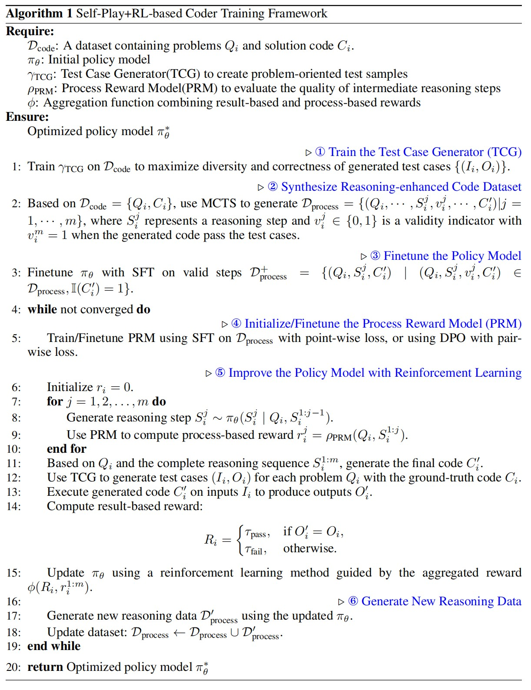

# O1-CODER
[O1-CODER: An O1 Replication for Coding (Paper)](https://arxiv.org/abs/2412.00154)

## Overview

**O1-CODER** is an attempt to replicate OpenAI's **O1 model**, focused on coding tasks. The approach combines **Reinforcement Learning (RL)** and **Monte Carlo Tree Search (MCTS)** to enhance the model’s **System-2** thinking capabilities, aiming to generate more efficient and logical code.

### Method

The core components of **O1-CODER** are:

1. **Test Case Generator (TCG)**: Automatically generates standardized test cases to evaluate the correctness of the generated code.
2. **Self-Play and Reinforcement Learning**: The model generates reasoning data through self-play, and uses RL and MCTS to iteratively optimize the policy model。
These methods work in an iterative cycle, continuously refining the model to improve systematic reasoning and optimization in coding tasks.

  

